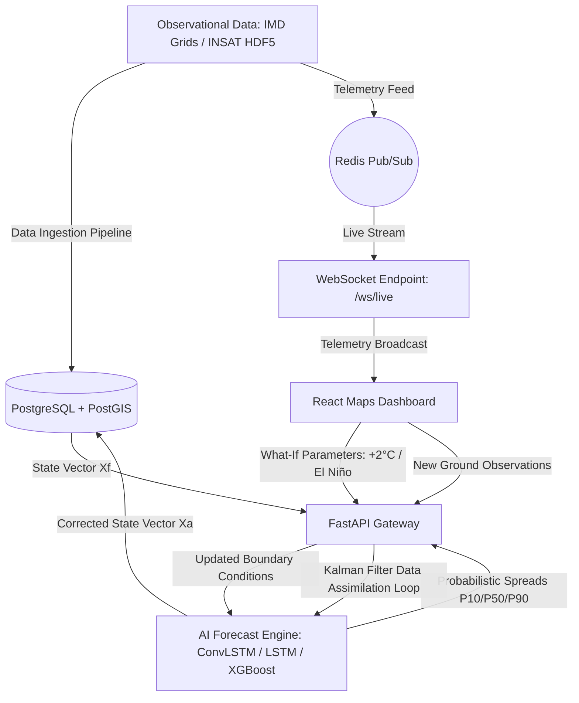

# 🌍 Global AI-Powered Climate Digital Twin System

An ISRO/NASA-grade production-ready, high-fidelity **Global Climate Digital Twin System** built to simulate, forecast, and visualize Earth’s climate in real-time. This system fuses global reanalysis proxies and India's national gridded datasets (IMD, INSAT) with advanced spatial-temporal deep learning and a closed-loop **Kalman Filter data assimilation** pipeline.

---

## 🔄 Core Digital Twin System Loop



---

## 🎨 System Modules & Architecture

### 1. 🌍 Global Map & Grid Engine
* **Visualizer**: React + TypeScript + Leaflet rendering a high-density global coordinate grid at **1° x 1° resolution**.
* **Gradient Color Scales**:
  * **Precipitation**: Blue $\rightarrow$ Purple $\rightarrow$ Red (heavy monsoon).
  * **Temperature/LST**: Blue (cold) $\rightarrow$ Green $\rightarrow$ Orange $\rightarrow$ Red (extreme heatwave).
  * **Anomaly**: Cyan $\rightarrow$ Magenta $\rightarrow$ Dark Red (critical deviation).
  * **Risk Index**: Green (safe) $\rightarrow$ Yellow $\rightarrow$ Orange $\rightarrow$ Red (critical hazard warning).

### 🖱️ 2. Cursor Intelligence System
* Emits real-time climate metadata card on mouse-hover, displaying:
  * Local coordinate coordinates, country, and state.
  * Ingested Temperature, Rainfall, and Land Surface Temperature (LST).
  * Aggregated Hazard Risk score and Anomaly deviation score.
* Interactive clicks on coordinates load the **Deep Analytics & Forecast panel**.

### 🤖 3. AI Forecasting Engine
* Fuses multiple models in a spatial-temporal ensemble:
  * **PyTorch ConvLSTM**: Captures spatial atmospheric grid dynamics over time.
  * **LSTM**: Processes local time-series climate trends.
  * **XGBoost**: Serves as a robust baseline regression model.
* Generates forecasts up to 14 days out with **Bayesian Uncertainty Spreads** ($P_{10}$, $P_{50}$, $P_{90}$).

### 🔄 4. Closed-Loop Data Assimilation
* Fuses model forecast priors ($X_f$) with new ground observations ($Z$) using a mathematical **1D/2D Kalman Filter**:
  $$K = \frac{P_f}{P_f + R}$$
  $$X_a = X_f + K(Z - X_f)$$
  $$P_a = (1 - K)P_f$$
* Calculates and reports uncertainty reduction percentages directly to the dashboard.

### 🌪️ 5. What-If Scenario Simulator
* Modifies global atmospheric parameters instantly:
  * **Temperature Offset**: Simulate $+2^\circ\text{C}$ global warming projections.
  * **Rainfall Shift**: Simulate droughts ($-20\%$) or flood cycles.
  * **Climate Oscillations**: Toggle El Niño / La Niña sea surface temperature shifts.

### 🌾 6. Climate-Sensitive Sector Applications
* **Agriculture Advisor**: Computes Crop Water Stress Index (CWSI) and Penman-Monteith derived irrigation needs.
* **Water Resources**: Calculates surface runoff using the **SCS Curve Number Hydrological Model** ($Q = \frac{(P - I_a)^2}{P - I_a + S}$) and reservoir inflow depletion risk.
* **Disaster Response**: Advanced categorization alerts for heatwaves, floods, and agricultural droughts.

### ⚙️ 7. Exporters & Data Consumers Config
* Interfaces to configure active data consumers (register webhooks and emergency email lists).
* Provides direct grid data downloads in **JSON/GeoJSON** file format.

---

## 📦 Directory Structure

```
├── ai-engine/             # PyTorch ConvLSTM forecasting & retraining services
├── backend/               # FastAPI Gateway with PostGIS connections and WebSockets
├── data-pipeline/         # Ingestion engine with IMD binary parsers & Redis stream
├── frontend/              # React + TS + Leaflet dashboard client
├── gis-engine/            # Overlay operations & rule-based hazard calculators
├── graph-engine/          # Teleconnection nodes and network resilience logs
├── infra/                 # Docker Compose config & PostGIS init SQL schema
└── tests/                 # Pytest integration API verification suites
```

---

## 🚀 Deployment & Execution

### Option A: Container Stack (Recommended)
Build and run the entire ecosystem (FastAPI, Redis, PostGIS DB, AI Engine, and Frontend client) under Docker:
```bash
cd infra
docker-compose up --build
```
Open `http://localhost:3000` to interact with the map dashboard.

### Option B: Local Standalone Execution
1. **Activate Virtual Environment**:
   ```bash
   venv\Scripts\activate
   ```
2. **Start Services**:
   ```bash
   # Terminal 1: AI Forecast Engine
   cd ai-engine
   uvicorn main:app --port 8001
   
   # Terminal 2: Data Pipeline Streamer
   cd data-pipeline
   uvicorn main:app --port 8004
   
   # Terminal 3: Backend Gateway
   cd backend
   python main:app
   
   # Terminal 4: Frontend Development Server
   cd frontend
   npm run dev
   ```
   Open `http://localhost:5173` to access the application locally.

---

## 🧪 Automated Verification
Validate the entire API gateway endpoints, WebSockets, and database persistence layers:
```bash
venv/Scripts/python -m pytest tests/
```
All integration tests verify status, data formats, and math assimilation outputs with a `200 OK` response.